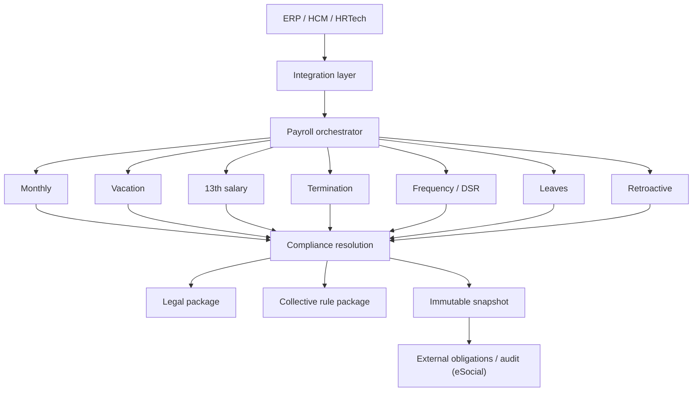

# Ordo Payroll Core

> Brazilian cloud-native payroll and compliance engine with bitemporal rule
> resolution, collective-bargaining support, eSocial integration and
> longitudinal payroll validation.

Ordo Payroll Core is the calculation-and-compliance engine that sits underneath
Ordo, a Brazilian payroll/accounting product. This repository is a **public,
sanitized technical showcase** of the engine as an asset — for CTOs, founders,
product leaders, corporate-development / M&A teams, ERP/HCM vendors, global
payroll companies and HRTech evaluators.

It is **documentation only**. No proprietary source code, secrets, or customer
data are published here. Deeper technical due-diligence material is available
privately under NDA.

---

## What it is

Ordo Payroll Core computes Brazilian payroll and its statutory obligations from
a **canonical history of contractual facts**, resolving the applicable legal and
collective-bargaining rules **by validity period** and producing an **immutable,
auditable result** (payslip events, tax bases, employer charges, vacation, 13th
salary, termination, and eSocial events).

It is designed to be **integrated as an engine** — an ERP/HCM/HRTech platform can
feed it payroll history and facts and consume a payroll result, without adopting
the Ordo end-user product.

## Why it exists

Brazilian payroll is not a formula; it is a **temporal rule-resolution problem**.
The correct number depends on *which rule was in force when the work happened*,
*which rule was known when the payroll was closed*, *when the payment is made*,
and *which collective agreement applies to that worker*. Getting this wrong
produces silent, compounding errors that surface months later as tax and labor
liabilities.

Ordo Payroll Core was built to make that resolution **explicit, versioned and
auditable**, and then validated **longitudinally** — month after month across a
two-year horizon — rather than only on isolated unit cases.

## Core capabilities

- **Deterministic monthly payroll** — INSS, IRRF, FGTS, salary-family, and a
  full event/rubric model, computed as a pure function of facts + resolved rules.
- **Bitemporal rule resolution** — separates *when a rule is effective* from
  *when it became known*; retroactive changes (e.g. collective raises) are paid
  as a **supplementary payroll** without rewriting the closed original.
- **Collective-bargaining support** — CCT/ACT/addendum modeling with
  applicability, clause precedence, and resolution traces.
- **Core Brazilian payroll domains** — vacation, 13th salary, terminations,
  leaves (including accident-leave FGTS), frequency/DSR, overtime/night premium,
  retroactive/supplementary payroll, and payroll-deductible worker credit
  (consignado).
- **eSocial integration** — event building, XSD validation, preflight hardening,
  and transmission through an isolated signing/transport executor.
- **Immutable snapshots + audit trace** — closed competences are versioned and
  frozen; every result carries an execution envelope and replay data.
- **No silent fallback** — missing legal or collective coverage raises an
  explicit coverage error instead of applying a wrong rule.

## Architecture at a glance



See [`docs/02-architecture/architecture-overview.md`](docs/02-architecture/architecture-overview.md).

## Brazilian payroll domains

Monthly payroll · Admission · Vacation (+ allowance) · 13th salary · Termination ·
Leaves (+ accident FGTS) · Frequency (absence / delay) · DSR · Overtime ·
Night premium · Salary substitution · Retroactive / supplementary payroll ·
Collective rules · Worker credit (consignado) · INSS · IRRF · FGTS ·
Salary-family · eSocial · Regulatory watch.

Per-domain status is in
[`docs/01-overview/functional-coverage.md`](docs/01-overview/functional-coverage.md)
and the deep dives in [`docs/03-payroll-domains/`](docs/03-payroll-domains/).

## Compliance model

Legal parameters (INSS, IRRF, salary-family, minimum wage, FGTS) are **versioned
by effective date** and resolved on a declared **temporal basis** — INSS/FGTS/
salary-family by *competence*, IRRF by *payment date* (cash basis). Collective
rules are modeled as a separate layer on top of the national baseline, with
addendum-as-delta and explicit precedence. If no applicable package exists, the
engine returns a **coverage error** rather than guessing.
See [`docs/04-compliance/`](docs/04-compliance/).

## Bitemporal rule resolution

The engine treats `VALID_TIME` (when a rule is effective) and `KNOWLEDGE_TIME`
(when it became known/registered) as independent axes. A collective raise
effective in the past but agreed later does **not** rewrite closed payrolls; the
difference is computed per originating competence and paid as a supplementary
run. See [`docs/02-architecture/temporal-model.md`](docs/02-architecture/temporal-model.md).

## Collective bargaining support

Collective instruments (CCT/ACT and their addenda) are modeled with
applicability (territory, professional/economic scope, exclusions), clause
families, effective ranges, and a resolution trace showing
`national baseline → collective applicability → collective override → final rule`.
See [`docs/04-compliance/collective-rule-package.md`](docs/04-compliance/collective-rule-package.md).

## eSocial integration

Ordo builds the relevant eSocial events (remuneration, admission, termination,
leave, payments, periodic close/reopen), hardens and validates input, checks
structure against the schema, and transmits through an **isolated executor** that
performs the digital signature (XMLDSig) and mutual-TLS transport. The signing
certificate is handled only at runtime and never exposed to the application
layer. See [`docs/04-compliance/esocial-architecture.md`](docs/04-compliance/esocial-architecture.md).

## Validation

Ordo Payroll Core has been exercised under an internal longitudinal validation
protocol ("Master Shadow"): the production engine is compared, month by month,
against an **independent oracle** implemented separately from the engine.

```
Master Shadow validation

24 consecutive competences (2024-09 → 2026-08)
6 synthetic personas
10 payroll domains
185 engine-vs-independent-oracle validations
0 final divergences
deterministic replay
immutable snapshot chain
24/24 persisted snapshots (isolated staging)
database reload match + process-restart replay
```

Validation was performed internally under the Ordo Master Shadow protocol.
This is **not** a third-party certification. Two issues found during validation
were traced to the *oracle* (the engine was vindicated) and are documented
openly. See [`docs/05-validation/`](docs/05-validation/).

## Integration model

```
ERP / HCM / HRTech
      ↓
Canonical Payroll History  +  Payroll Facts
      ↓
Ordo Payroll Core
      ↓
Payroll Result · Tax Bases · Charges · Vacation · 13th · Termination ·
eSocial · Audit Trace · Replay Data
```

The engine consumes a canonical history of contractual facts and current-period
facts, and returns a payroll result with a full audit trace. See
[`docs/06-integration/`](docs/06-integration/).

## Current maturity

- Deterministic monthly engine and the listed payroll domains are **implemented**
  and covered by internal golden tests.
- Longitudinal engine-vs-oracle validation across 24 months is **complete** with
  zero final divergences (internal protocol).
- Persistence of the validation chain is **validated in an isolated staging
  environment** (reload, replay, restart, idempotency, transactional rollback).
- eSocial event building, hardening, schema checks, and the isolated
  signing/transport executor are **implemented**; end-to-end transmission has
  been exercised against the government **restricted-production (homologation)**
  environment, not production.

## Known boundaries

Ordo Payroll Core is honest about the edges of its validated scope:

- The validated scope is **finite**. Not every Brazilian collective agreement is
  implemented; the deep collective coverage demonstrated so far is centered on
  the instruments used in validation.
- Not every employment category has been **longitudinally** validated.
- **Migration adapters** for specific legacy vendors are not all built; the
  integration surface is a canonical model, not a set of shipped connectors.
- **No external, third-party certification** has been performed. The validation
  described here is an internal protocol.

Full list: [`docs/appendices/evidence-matrix-public.md`](docs/appendices/evidence-matrix-public.md)
and the "Known boundaries" section of each domain document.

## Acquisition / OEM

The engine can be structured as a technology/IP acquisition, an exclusive or
non-exclusive OEM license, a white-label deployment, a hosted payroll API, or a
dedicated deployment. See
[`docs/08-transaction/acquisition-oem-overview.md`](docs/08-transaction/acquisition-oem-overview.md).
No pricing or definitive legal terms are published here.

## Contact

Commercial and technical due-diligence contact:
`COMMERCIAL_CONTACT_TO_BE_DEFINED`.

Deeper technical documentation (product & technology dossier, validation
dossier, integration dossier, IP inventory, evidence matrix) is available under
NDA as a private data room.

---

*Copyright © 2026 Inventare Solutions LTDA. All rights reserved. Publication of
this documentation does not grant a license to the underlying proprietary
software. See [`COPYRIGHT.md`](COPYRIGHT.md).*
