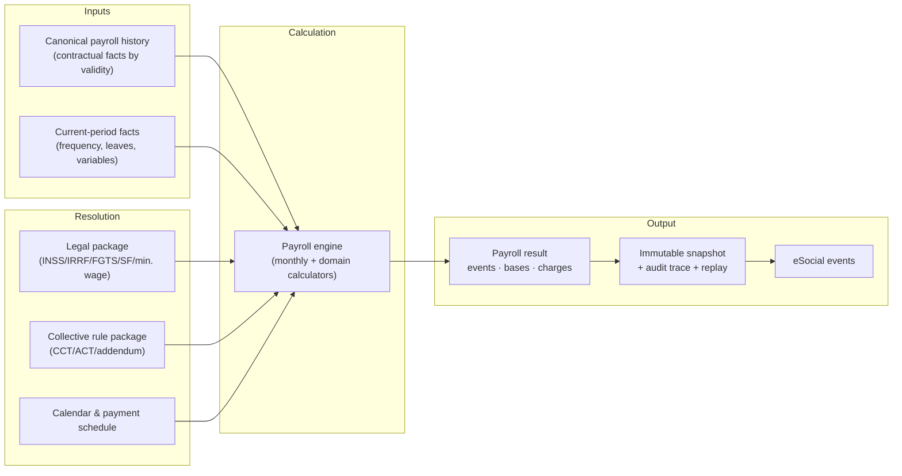

# Product Overview

*Public documentation. High-level by design; internal implementation detail is
intentionally omitted.*

## The problem

Brazilian payroll is one of the most rule-dense payroll regimes in the world. A
single monthly payslip is the product of overlapping, time-versioned rule sets:

- **Federal fiscal parameters** — social security (INSS), income tax (IRRF),
  severance fund (FGTS), salary-family allowance, minimum wage — each with its
  own effective dates, and each resolved on a different temporal basis.
- **Collective bargaining** — sector/territory agreements (CCT/ACT) and their
  addenda that set wage floors, overtime and night-premium rates, workweek
  length, contribution rules, and payment calendars, frequently *overriding* the
  national baseline.
- **Labor-law events** — admissions, leaves, absences, vacation acquisition,
  13th-salary accrual, terminations — each with statutory formulas that depend on
  the employee's history.
- **eSocial and ancillary obligations** — the government digital bookkeeping
  system that must receive structurally valid, digitally signed events.

The hard part is not the arithmetic. It is deciding **which rule applies, for
which worker, in which month, known as of when, paid on which date** — and doing
so consistently across time so that closed periods remain trustworthy and
retroactive changes are handled without corrupting history.

## What Ordo Payroll Core is

Ordo Payroll Core is the **engine** underneath the Ordo product: the part that
turns *facts + resolved rules* into an *auditable payroll result*. It is designed
so that a third party (an ERP, an HCM suite, an HRTech platform, a global payroll
provider) can integrate the engine on its own, without adopting the Ordo
end-user application.

It is built around four principles:

1. **Facts are canonical and temporal.** The engine consumes a canonical history
   of contractual facts (salary, role/CBO, workweek, contract type/duration,
   dependents) plus current-period facts (frequency, leaves, variable events).
   Each fact is a segment with a validity period.
2. **Rules are versioned and resolved, not hardcoded.** Legal parameters and
   collective clauses are versioned by effective date and resolved on a declared
   temporal basis; the resolution is traceable.
3. **No silent fallback.** If coverage for a required rule is missing, the engine
   raises an explicit coverage error rather than applying a nearby-but-wrong rule.
4. **Results are immutable and auditable.** A closed competence produces a
   versioned, frozen snapshot; every result carries the data needed to explain
   and replay it.

## Engine architecture (conceptual)

### Inputs

- **Canonical payroll history** — the five contractual facts (remuneration;
  role/function/CBO; workweek; contract type/duration; dependents) modeled as
  time segments with `effective-from / effective-to` and a "trusted-since" marker
  that blocks calculation over periods the data provenance does not support.
- **Current-period facts** — frequency occurrences (absence, delay, early
  departure), leaves, overtime/variable events, consigned-credit installments,
  and so on. These are **facts**, sourced explicitly; the engine never *infers*
  an absence from missing data.

### Calculation

The monthly engine is a **pure function**: given the employee record, the days in
the month, the applicable facts, and the resolved rules, it produces a complete
set of payslip events and the derived tax bases (INSS, IRRF, FGTS), deductions,
employer charges and net pay. Specialized calculators handle vacation, 13th
salary, terminations, leaves, frequency/DSR, overtime, and retroactive/
supplementary payroll, each with its own temporal semantics.

### Compliance

Rule resolution is a distinct layer. The **legal package** resolves federal
parameters by effective date (INSS/FGTS/salary-family/minimum wage by competence;
IRRF by payment date). The **collective rule package** resolves the applicable
CCT/ACT and its clauses, applying addenda as deltas and tracing the precedence
from national baseline to final rule. The **calendar & payment schedule** resolve
which day each payment is due and paid, which in turn feeds the payment-date basis
for income tax.

### Outputs

- A **payroll result**: line-by-line events, tax bases, employer charges,
  vacation/13th/termination figures.
- An **immutable snapshot** of a closed competence, versioned and frozen.
- **eSocial events** built, hardened, schema-checked, and transmitted through an
  isolated signing/transport executor.
- An **audit trace** and **replay data** sufficient to explain and reproduce the
  result.

## Auditability

Every calculation can be explained. Tax computations expose their brackets, bases
and deductions; each payslip event records exactly which rubric produced which
amount under which incidence. Divergences against an external system are captured
as classifiable incidents with a minimal **replay capsule** (engine version,
legal package, input fingerprint, field-level differences) that lets an analyst
reproduce and classify the difference without handling personal data.

## Integration

An external platform integrates the engine by supplying the canonical history and
current facts and consuming the payroll result. The engine's boundary is a
**product-language contract** (compute payroll, close competence, build eSocial
event) rather than raw database access. See
[integration architecture](../02-architecture/integration-architecture.md) and the
[payroll-core contract](../06-integration/payroll-core-contract.md).

## What this document does not cover

This overview deliberately omits internal algorithms, module topology, table
schemas, and the specific formulas that constitute the proprietary value of the
engine. Those are described — to the extent needed for due diligence — in the
private data room, under NDA.
