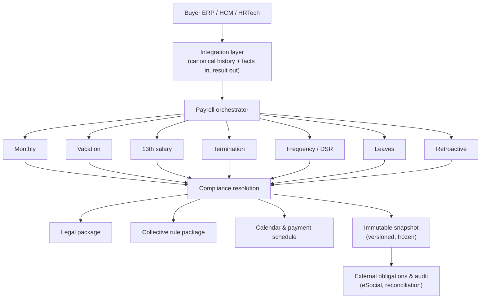

# Architecture Overview

*Public, high-level architecture. Internal module topology, class names, private
endpoints and full schema maps are intentionally not published.*

## Design goals

Ordo Payroll Core is organized around a few load-bearing decisions:

1. **Separate facts, rules, and calculation.** Facts (what happened) are distinct
   from rules (what the law/agreement says) which are distinct from calculation
   (turning both into numbers). Each can evolve and be audited independently.
2. **Pure calculation core.** The monthly engine is a pure function of its inputs;
   it performs no I/O and reads no ambient state. Given the same facts and
   resolved rules, it produces the same result — which is what makes deterministic
   replay possible.
3. **Explicit temporal resolution.** Every rule lookup declares its temporal basis
   (competence vs payment date) and fails loudly if coverage is missing.
4. **Immutable outputs.** A closed competence is a versioned, frozen snapshot.
   Reopening never destroys the prior snapshot.
5. **Cloud-first, authoritative server.** The system of record is a server-side
   database reached through a product-language contract; clients (web, desktop)
   are consumers, not the source of truth, and never compute statutory rules
   themselves.

## High-level flow

## Layers

### 1. Integration layer

The engine is reached through a **product-language contract** — operations such as
"compute payroll for this competence", "close competence", "build this eSocial
event" — rather than raw database access. Clients call this contract over HTTP;
the server is authoritative. Errors are explicit and typed (not-authenticated,
out-of-scope, validation, not-found, unavailable, conflict), never a silent
fallback to a local store. See
[integration architecture](integration-architecture.md).

### 2. Payroll orchestrator and domain calculators

The orchestrator composes the domain calculators for a competence. The **monthly**
calculator is the spine; **vacation**, **13th salary**, **termination**,
**leaves**, **frequency/DSR**, **overtime**, and **retroactive/supplementary**
are specialized calculators, each with its own temporal semantics. Judicial
deductions are handled by a separate **versioned judicial domain** and cannot be
injected through the manual event channel.

### 3. Compliance resolution

A distinct layer resolves the rules the calculators need:

- **Legal package** — federal fiscal parameters versioned by effective date,
  resolved on a declared temporal basis (competence for INSS/FGTS/salary-family/
  minimum wage; payment date for income tax).
- **Collective rule package** — the applicable CCT/ACT and its clauses, with
  addendum-as-delta and a resolution trace.
- **Calendar & payment schedule** — day semantics (calendar/working/banking/
  salary-payment day) and payment-date resolution per payment nature.

### 4. Immutable snapshot & audit

A closed competence produces a **versioned snapshot** capturing the facts used,
the resolved rules, the engine version, and the output. Snapshots are append-only;
reopening a competence preserves the prior snapshot. Every result carries an
**execution envelope** and enough data to **replay** it.

### 5. External obligations executor

eSocial events are built, hardened, and schema-checked in the application layer,
then handed to an **isolated executor** that performs the digital signature and
mutual-TLS transport to the government environment. The signing certificate is
handled only at runtime, inside the executor, and is never exposed to the
application or client layers. See
[eSocial architecture](../04-compliance/esocial-architecture.md).

## Determinism and replay

Because the calculation core is pure and rule resolution is explicit, a result can
be reproduced from its inputs. The validation protocol relies on this: it computes
a competence, freezes a content hash, persists it, reloads it from the database,
and **recomputes** it — expecting an identical hash. This property is what lets the
system prove that "what was calculated is exactly what persists, reloads, and
replays". See [validation overview](../05-validation/validation-overview.md).

## What is not published here

Internal service names and topology, private endpoint paths, the full database
table map, and the proprietary formulas inside the calculators are omitted from
public documentation. They are available, to the extent needed for due diligence,
in the private data room under NDA.
