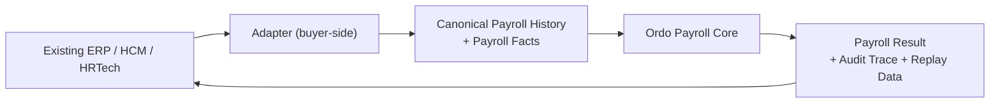
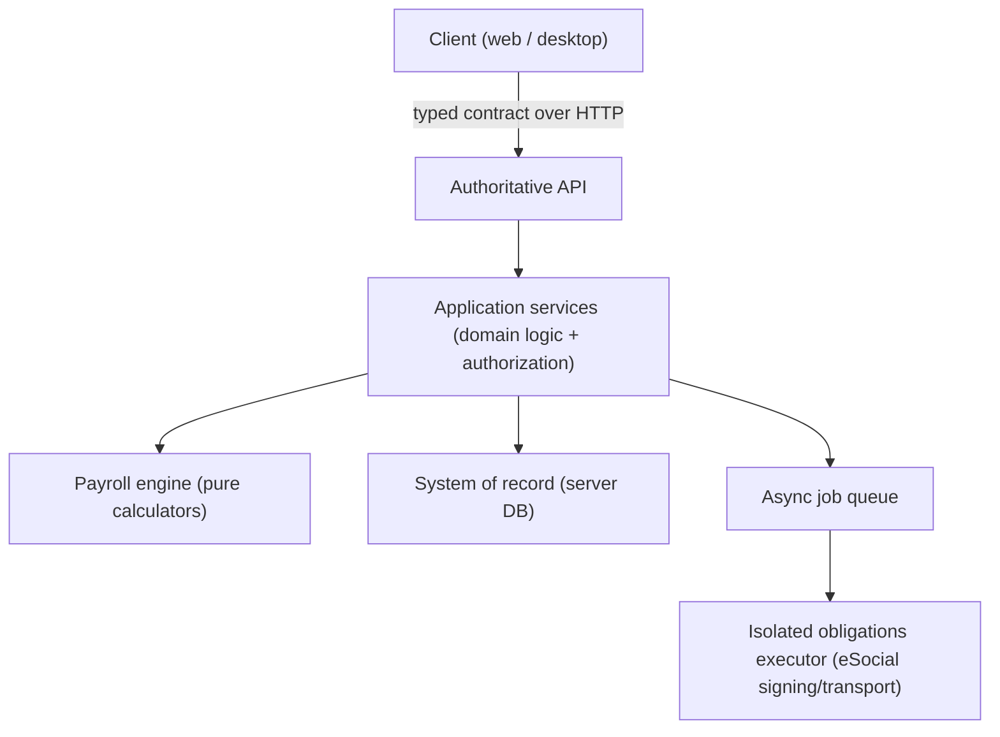

# Integration Architecture

*How an existing ERP/HCM/HRTech can use Ordo Payroll Core as an engine without
adopting the Ordo end-user product.*

## The question this answers

> Can a platform integrate only the payroll/compliance engine, keeping its own
> front office, master data, and workflows?

Yes. The engine's boundary is a **product-language contract** over a canonical
data model, not a coupling to the Ordo application. An external system supplies a
**canonical payroll history** plus **current-period facts**, and receives a
**payroll result** with an audit trace.

## Target integration pattern

1. **Adapter (buyer-side).** The buyer maps its own employee/contract/history data
   to the canonical model. This adapter is a **target integration pattern**, not a
   shipped connector — see *Boundaries* below.
2. **Canonical payroll history + facts.** The contractual facts (remuneration,
   role/CBO, workweek, contract type/duration, dependents) as time segments, plus
   current-period facts (frequency, leaves, variable events, worker-credit
   installments).
3. **Ordo Payroll Core.** Resolves the applicable legal and collective rules,
   runs the domain calculators, and produces the result.
4. **Result + audit.** Payroll events, tax bases, employer charges, vacation/13th/
   termination figures, eSocial events, and the data needed to explain/replay.

## The runtime boundary

The engine runs behind an **authoritative server** reached over HTTP through a
typed contract. Key properties:

- **Product-language operations.** Callers issue operations like "compute payroll
  for competence", "close competence", "reopen competence", "build eSocial event"
  — not raw SQL.
- **Explicit, typed errors.** Failures are typed (not-authenticated, out-of-scope,
  permission-denied, validation, not-found, unavailable, conflict). There is **no
  silent fallback** to a local store; a missing capability is an explicit error.
- **Server-side calculation only.** Statutory calculation happens on the server.
  Clients (web or desktop) are consumers; they never compute legal rules
  themselves.
- **Context in the path, credentials in the session.** The tenant/company context
  is part of the operation address; the caller's identity travels as a session
  token, never as a value in the request body.

## Asynchronous obligations

Government transmission (eSocial and related queries) runs as **idempotent
background jobs** with lease-based claiming, bounded retries, and **honest outcome
classification** that distinguishes:

- `SUCCEEDED` — accepted, with the government receipt;
- `REJECTED` — a business/schema rejection, with the reason preserved;
- `BLOCKED_EXTERNAL` — an external precondition is missing (certificate absent,
  executor unreachable, service down) — **re-drainable**, not a failure;
- `TRANSIENT_ERROR` — a timeout that can be re-queried.

Duplicate transmission is prevented: events already in a terminal state are not
re-sent, so re-running a drain is a no-op rather than a double submission.

## What the buyer keeps

- Its own UI, identity provider, and workflows.
- Its master data as the source, mapped into the canonical model by its adapter.
- The choice of migration strategy (full history, opening snapshot, or hybrid) —
  see [migration strategy](../06-integration/migration-strategy.md).

## What the engine provides

- Deterministic, auditable payroll computation across the Brazilian domains.
- Rule resolution (legal + collective) with traces.
- Immutable snapshots, replay data, and incident-classification machinery.
- eSocial event building and an isolated signing/transport executor.

## Boundaries (honest)

- The buyer-side adapter to a specific legacy vendor (for example
  Contmatic, Domínio, Senior, or TOTVS) is a **possible adapter / target
  integration pattern**. Ordo ships **parsers for common interchange formats**
  (delimited files, eSocial XML, and other standard layouts) and a canonical
  model, **not** turnkey connectors for every vendor. Building a specific
  connector is integration work.
- The public API surface described here is the **intended contract**; where a
  given operation is not yet exposed as a public, documented endpoint, treat it as
  a `TARGET PUBLIC CONTRACT` rather than a shipped API. See
  [payroll-core contract](../06-integration/payroll-core-contract.md).

## Summary

Integration is a matter of **mapping to a canonical model and calling a
product-language contract**. The engine does the rule resolution and calculation;
the buyer keeps its front office. Connectors to specific legacy systems are
integration work, not pre-shipped features — and the documentation says so plainly.
