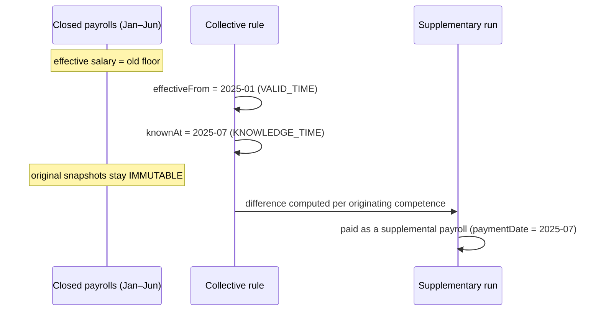

# Temporal Model

*This is the conceptual heart of Brazil Payroll & Compliance Engine and its strongest public
differentiator.*

Brazilian payroll correctness depends less on arithmetic and more on **time**. The
same input produces different correct answers depending on *when* the work
happened, *when* it is paid, *when* a rule became effective, and *when* that rule
became known. Brazil Payroll & Compliance Engine models these as **first-class, independent
temporal dimensions**.

## The vocabulary

| Term | Meaning |
|---|---|
| **competence** | The reference month the work/salary belongs to (e.g. `2026-08`). Drives social-security, FGTS, salary-family and minimum-wage resolution. |
| **paymentDate** | The date remuneration is actually paid. Drives income-tax (IRRF) resolution on a **cash basis** — it can differ from competence and move intra-year. |
| **occurrenceDate** | The date a fact happened (an absence, a delay). Can predate the competence it is applied to. |
| **applicationCompetence** | The payroll month a fact is applied to, which may differ from its occurrence date (e.g. a late-arriving absence). |
| **effectiveFrom / effectiveTo** | The **validity period** of a rule or a contractual fact — the window during which it is legally in force (`VALID_TIME`). |
| **knownAt / registeredAt** | When a rule or fact **became known / was registered** in the system (`KNOWLEDGE_TIME`). |

## The central idea: `VALID_TIME ≠ KNOWLEDGE_TIME`

A rule can be **effective in the past** yet **become known later**. The canonical
example is a collective raise:

- A collective agreement sets a new wage floor **effective** `2025-01`.
- The agreement is only **signed/registered** in `2025-07`.
- Payrolls for `2025-01` … `2025-06` were already **closed** before the raise was
  known.

A naive system either rewrites the closed months (destroying history and
re-triggering already-filed obligations) or ignores the retroactivity (underpaying
the worker). Brazil Payroll & Compliance Engine does neither.



### How retroactivity is handled

```
rule effective in the past
+ rule becomes known later
→ original closed payroll remains IMMUTABLE
→ the difference is computed separately, per originating competence
→ a supplementary payroll pays it, on its own payment date
```

The difference is **not** `newSalary − oldSalary` applied bluntly. For each
affected competence, the engine recomputes that month on the correct base (using
the salary history in force at the time and the days actually due), recomputes the
statutory reflections (overtime, night premium, vacation and 13th averages), and
applies the correct tax treatment for retroactive amounts. The original snapshot is
never mutated; a **linked supplementary record** carries the difference.

## Why two axes are necessary, not academic

- **Trust in closed periods.** Financial and tax filings reference closed
  competences. If closing is not immutable, every downstream obligation is
  suspect. Immutability + supplementary runs preserve the integrity of what was
  filed.
- **Correct taxation of retroactive pay.** Income tax on amounts relating to prior
  years follows a different regime than current-month tax. Because the engine
  knows both the **originating competence** and the **payment date**, it can apply
  the correct treatment instead of taxing everything as if earned today.
- **Auditability.** Every number can point to the rule that produced it *and* to
  when that rule was effective and known. A reviewer can answer "why is this
  value what it is?" without reverse-engineering code.

## Contractual facts are temporal too

The same discipline applies to the employee's own data. The **five contractual
facts** — remuneration; role/function/CBO; workweek; contract type/duration;
dependents — are stored as **time segments** with `effectiveFrom / effectiveTo`
and a provenance origin. For a given competence, the engine resolves the segment
in force on the relevant day.

A **"trusted-since" marker** guards data provenance: if a competence falls before
the point from which a fact's source is trusted (for instance, before a migration
cutover), the engine returns a **review-required** state rather than calculating on
unreliable history. This is another instance of *no silent fallback*.

## Payment-date resolution feeds taxation

Because income tax is resolved on the **payment date**, the temporal model closes a
loop with the calendar and payment-schedule layer:

```
competence  ──→ resolves INSS / FGTS / salary-family / minimum wage
payment schedule (national or collective) ──→ resolves paymentDate
paymentDate ──→ resolves the income-tax table (cash basis)
```

So the income-tax table used for an August competence paid in early September is
the table in force in **September**, not August — and if a collective agreement
moves the payment date, the tax resolution follows.

## Summary

Brazil Payroll & Compliance Engine treats time as structure, not metadata. Competence, payment
date, occurrence, application, effective-from/to and known-at/registered-at are all
explicit. That is what allows it to keep closed periods immutable, pay
retroactivity correctly, tax it correctly, and explain every number — the
properties that matter most in a regulated payroll engine.
