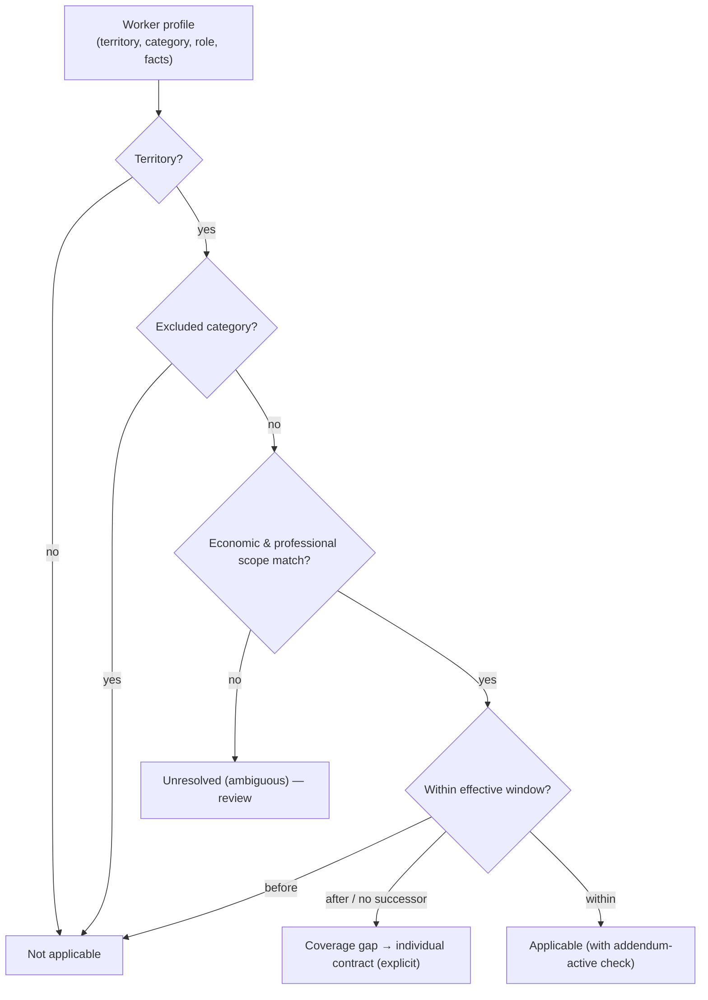

# Collective Rule Package

Collective bargaining is modeled as a **separate layer** on top of the national
baseline, with applicability resolution, clause families, addendum-as-delta, and a
resolution trace from national baseline to final rule.

## Purpose

Resolve the collective-bargaining rules that apply to a given worker in a given
competence — wage floors, overtime and night-premium rates, workweek/divisor,
payment calendars, contributions — and how they **override** the national baseline,
with a full trace of the decision.

## Domain model

The model is deliberately structured rather than free-text:

- **Instrument** — a collective agreement (CCT), a company-level agreement (ACT), or
  an **addendum**. It carries its registration identity, the parties, the
  applicability scope, effective dates, the base date, provenance (source reference
  and a hash of the original text), and its clauses.
- **Clause** — a numbered provision belonging to a **rule family** (floor,
  adjustment, workweek, overtime, night premium, contributions, payment dates, and
  so on), with an effective range, a provenance hash, and an implementation status.
- **Applicability** — the territory, professional scope, economic scope, entity
  nature, establishment condition, and exclusions that determine whether the
  instrument applies.
- **Resolution trace** — the chronological steps, the resolved rule, its source, its
  origin (national / collective / addendum / individual), the rejected candidates,
  and the reason.

Clauses carry an explicit **implementation status**: implemented-and-computable,
computable-but-pending, declarative (procedural text that legitimately needs no
algorithm), or requires-human-review. This makes coverage honest: a clause that
affects calculation but is not yet implemented **blocks** rather than being silently
ignored.

## Applicability resolution



If an instrument has expired and no successor is confirmed, the result is an
**explicit gap** that routes to the individual contract — never a silent fallback to
the national baseline as if the collective rule still applied.

## Precedence and addendum-as-delta

An addendum **alters specific clauses** (identified by family); the other clauses are
**inherited** from the base instrument. Resolving a clause family therefore prefers
the addendum's version where present, else the base instrument's version, else raises
"rule not present". The precedence is always traceable:

```
national baseline → collective applicability → collective override → final rule
```

For example, resolving the wage floor for a worker with a prior salary computes the
adjustment over the prior salary and compares it to the floor, taking the greater —
and records which rule (adjustment-over-prior vs floor) won and why.

## Fact-gated contributions

Some collective contributions are **fact-gated**: they apply only under specific
conditions (for example, whether the worker recorded an opposition, or is a union
member). The engine **requires** the relevant fact; if it is missing, it raises a
"deduction fact missing" error rather than silently deducting or not deducting. This
prevents both unlawful deductions and silent omissions.

## Instruments used in validation

The longitudinal validation exercised a real, publicly-registered collective
instrument-set and its addendum (a sector agreement and a later addendum), with the
full clause inventory classified by implementation status. Within that set, the
engine implements the floor and function tables, the adjustment, the workweek and
divisor override, the overtime and night-premium overrides (set above the national
minimums), the fact-gated contributions, and the payment calendar (which, in that
set, coincides with the national baseline and is marked resolved without override).

This documentation references the use of such instruments as evidence; it does **not**
reproduce third-party agreement texts.

## Validation status

`PARTIALLY_VALIDATED`. The **model** is complete and the instrument-set used in
validation is fully implemented and passed the longitudinal protocol (including the
fact-gated contribution cases via a dedicated probe). The **universe** of Brazilian
collective agreements is vast and is a documented boundary.

## Known boundaries

- The engine implements a complete, auditable **model** and the specific instruments used
  in validation — not every Brazilian agreement. Extending coverage to another
  agreement is rule-authoring work against the model.
- Clauses that require human judgment (certain stability or classification
  provisions) are marked as review-required by design.
- Expired instruments without a confirmed successor produce an explicit gap, not a
  silent continuation.
