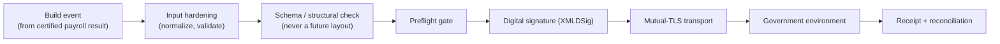

# eSocial Architecture

The engine builds the relevant eSocial events, hardens and validates them, checks their
structure against the schema, and transmits them through an **isolated executor**
that performs the digital signature and mutual-TLS transport. The signing
certificate is handled only at runtime, inside the executor, and is never exposed to
the application or client layers.

## Scope of this document

This describes the **architecture and security posture** of the eSocial path at a
level appropriate for public documentation. It does not publish certificates,
private keys, secrets, real taxpayer identifiers, real receipt/protocol numbers, or
production endpoint credentials.

## Event coverage

The engine builds the payroll-relevant eSocial events, including:

- **Remuneration** and **payment** periodic events;
- **Admission** and **termination** non-periodic events;
- **Leave** events;
- **Periodic close / reopen** events, whose closure flags are derived from the events
  actually present in the competence.

## Pipeline

1. **Build** — the event is assembled from the certified payroll result.
2. **Input hardening** — text and numeric normalization; structural and semantic
   validation (identifier formats and checksums, competence and date formats,
   currency rounding); warnings surfaced separately.
3. **Schema / structural check** — the event's structure, identifier format and
   namespace are checked; the schema version is resolved so that a **future** layout
   is never generated before its effective date.
4. **Preflight gate** — invalid input **cannot reach** serialization/transmission; a
   blocked or review-required event stops at the gate with its reasons.
5. **Signature and transport** — a valid event is handed to the isolated executor,
   which signs it (XMLDSig, enveloped) and transmits it over mutual TLS.

## The isolated executor

The signing and transport run in a **separate executor process** with a narrow
contract (a health check and an execute operation). The application layer never
performs cryptography and never handles the certificate bytes. The executor:

- Loads the signing certificate **only in memory, only at runtime**;
- Signs each event (XMLDSig, enveloped) and assembles the transport envelope;
- Performs mutual-TLS transport to the government environment, with strict
  certificate validation (invalid certificates are never accepted);
- Returns an **honest outcome** classification (see below).

## Certificate handling and security posture

The signing certificate (an A1-type certificate) is held in a **certificate vault**:

- **Encrypted at rest** with authenticated encryption (AES-256-GCM), sealed in an
  envelope; the master key is provided externally and never stored with the data or
  in code.
- **Public metadata separated** — status endpoints expose only non-sensitive
  metadata (validity, subject/issuer, thumbprint); the certificate material and its
  password are **never** returned to any client or API response.
- **Runtime-only material** — when a transmission runs, the worker resolves the
  certificate material and passes it to the executor **in memory**; it is never
  persisted in the job record.
- **Redaction** — logs redact any secret-bearing fields.

The security gates enforced on this path include: no production endpoint is reached
in validation (an environment guard blocks it), no secret ever appears in a browser
or API response or log, no certificate is stored unencrypted, no certificate is
persisted in a job, and no fabricated external success is ever reported.

## Honest outcome classification

Transmission outcomes are classified honestly and distinctly:

| Outcome | Meaning |
|---|---|
| `SUCCEEDED` | Accepted by the government, with a receipt. |
| `REJECTED` | A business/schema rejection, with the reason preserved. |
| `BLOCKED_EXTERNAL` | An external precondition is missing (certificate absent, executor unreachable, service unavailable). **Re-drainable**, not a failure. |
| `TRANSIENT_ERROR` | A timeout that can be re-queried using the preserved protocol. |

**Idempotency**: events already in a terminal state are not re-transmitted, so
re-running a drain is a no-op rather than a duplicate submission.

## Reconciliation

After transmission, the engine reconciles its computed values against the government's
totalization — for social security, the severance fund (by category and per worker),
and income tax — field by field with a tolerance, detecting even compensating errors
(where a total matches but a per-worker breakdown does not).

## What has been exercised

The full event chain (tables → admission → remuneration → periodic close) has been
exercised end to end against the government's **restricted-production (homologation)**
environment, with valid digital signatures, successful mutual-TLS handshakes,
official-format receipts, and **zero reconciliation delta** on the reconciled fields.
The production environment is **not** reached — it is blocked by design during
validation.

## Validation status

`PARTIALLY_VALIDATED`. Event building, hardening, schema checks, the isolated
signing/transport executor, honest outcome classification, idempotency, and
reconciliation are implemented and exercised against restricted-production. Live
**production** transmission is intentionally gated (a governance decision, not a
technical gap).

## Known boundaries

- End-to-end has been exercised against **restricted-production (homologation)**, not
  production.
- Importing a specific real signing certificate into a given deployment's vault is an
  operational step, gated behind authorization.
- The event coverage is the payroll-relevant set; the full eSocial event universe is
  broader than what a payroll engine emits.
