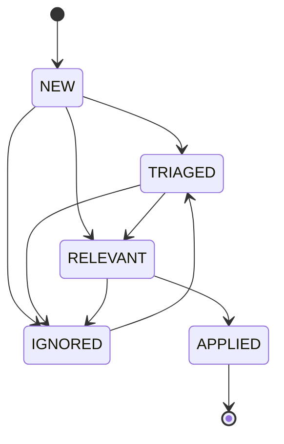

# Regulatory Watch

Regulatory watch is a **classification and tracking** model for regulatory change
signals. It does **not** auto-modify rules; it classifies, deduplicates, and tracks
signals through a lifecycle so that a change becomes a deliberate, reviewed update.

## Purpose

Capture signals of regulatory change from official sources, classify their type and
potential impact, deduplicate them, and move them through a review lifecycle — so
that a parameter or rule change is applied intentionally, with provenance, rather
than silently or automatically.

## What it is (and is not)

- It **is** a structured, source-of-record model: every signal carries an external
  reference (proof against fabrication) and a mandatory summary.
- It **is not** an autonomous rule-patching mechanism. The watch never changes an
  economic rule on its own; applying a change is a separate, classified action.

Three invariants govern the model:

- **No autonomous change** — the watch does not auto-patch rules.
- **No duplicate signal** — signals are deduplicated by a fingerprint of
  `source + external-reference`.
- **No fabricated source** — a signal without an external reference and summary is
  rejected.

## Change classification

Signals are typed so that their operational meaning is clear:

- **Parameter update** — a rate or table changes (e.g. a new year's fiscal
  parameters). Handled as a versioned addition to the [legal package](legal-package.md).
- **Rule configuration** — a rule's configuration changes (e.g. a new collective
  clause).
- **Engine change** — the change requires new calculation logic.
- **Protocol change** — an external protocol changes (e.g. an eSocial layout/schema
  version).

Each signal also carries a **potential-impact** classification (payroll, employer
charge, eSocial, obligation, master data) to route review.

## Source feeds

The model recognizes official source categories — the federal gazette, the eSocial
system, the severance-fund digital system, the federal-revenue monthly obligation,
and the collective-instruments mediation system. These are the **categories** a
signal can originate from; the automated ingestion pipelines that pull from them are
a planned capability, not an implemented monitor.

## Lifecycle

A signal moves from **new** through triage to **relevant** and finally **applied**
(a terminal state), or is **ignored** (and can be reopened). Applying a change is a
deliberate transition, not an automatic side effect.

## Validation status

`IMPLEMENTED`. The signal model, fingerprint deduplication, source/summary
validation, lifecycle transitions, and impact classification are implemented. The
schema-version resolution for eSocial (never generating a future layout before its
effective date) is part of the [eSocial architecture](esocial-architecture.md).

## Known boundaries

- **Automated source ingestion is `PLANNED`.** The model classifies and tracks
  signals; connecting live feeds from each official source is a separate capability.
- The watch is **advisory** by design: it never patches rules automatically. That is
  a safety property, not a limitation to be "fixed".
