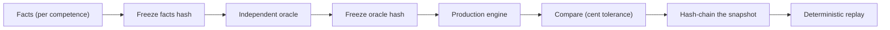

# Validation Overview

Ordo Payroll Core is validated **longitudinally** — month after month across a
two-year horizon — by comparing the production engine against an **independent
oracle** implemented separately from the engine. This is an internal protocol, not a
third-party certification.

## Why longitudinal, and why an independent oracle

Unit tests confirm isolated cases. They do not confirm that a payroll operation is
correct **over time** — that closing is immutable, that retroactivity is handled
without corrupting history, that rule resolution stays correct as parameters change
across months. The Master Shadow protocol was built to test exactly that.

The key methodological choice is **independence**: the oracle does not import the
engine's calculation code. It is a separate implementation of the same statutory
rules. When the two agree to the cent across every domain and every month, the
agreement is meaningful because it is not two copies of the same code agreeing with
themselves.

## The protocol



For each competence: the facts are frozen; an independent oracle computes the
expected result; the production engine computes its result; the two are compared to
the cent; the outcome is committed to an immutable, hash-chained snapshot; and the
whole thing is replayed deterministically.

## Results

```
Domains certified (engine vs independent oracle)
──────────────────────────────────────────────────────────────
Monthly (salary → INSS/IRRF/FGTS/salary-family) .... 137 / 137
Retroactive (two collective adjustments) ...........  24 / 24
13th salary ........................................  12 / 12
Vacation + averages ................................   1 / 1
Frequency + DSR ....................................   1 / 1
Leaves + accident-FGTS .............................   2 / 2
Overtime (+ DSR) ...................................   2 / 2
Worker credit + salary substitution ................   1 / 1
Collective (probe: applicable / opposition / exempt / missing-fact) . 4 / 4
Termination ........................................   1 / 1
──────────────────────────────────────────────────────────────
Total ............ 185 validations · 0 final divergences
```

Aggregate gates:

```
24/24 competences (hash-chain GENESIS → final)       = TRUE
all domain oracles                                    = CERTIFIED
engine-vs-oracle divergences                          = 0
all replays deterministic                             = TRUE
hash-chain integrity                                  = PASS
previous-snapshot mutation                            = 0
oracle imports of production calculation code         = 0
```

## The two findings (and why they build credibility)

Two discrepancies surfaced during validation. **Both were in the oracle**, and the
engine was vindicated in each. They are documented openly:

1. **13th-salary severance rounding.** The oracle computed the severance fund on the
   whole bonus; the correct behavior (which the engine implemented) is to deposit
   **per installment, each rounded**, matching the severance-fund system. Monetary
   difference: three cents. Fixed in the oracle only.
2. **Vacation income-tax temporal resolution.** The oracle resolved income tax by the
   year's table; the engine correctly resolved it by the **payment date** (cash
   basis), which changed the applicable table and the result. Fixed in the oracle
   only.

Neither production code nor any prior snapshot was mutated to accommodate a finding.
A governance guard was added after the first incident to block any
mutation/re-run-with-fix during a validation stop until a human resolution is
recorded. That an internal validation surfaced real issues, attributed them
correctly, and preserved the evidence is itself a signal of the protocol's rigor.

## What the validation proves about the engine

- Correct fiscal resolution by validity period (social security by competence,
  **income tax by payment date**).
- Correct collective resolution and precedence (floor/adjustment, workweek, overtime,
  night premium, fact-gated contributions).
- **Bitemporality**: closed payroll immutable; retroactive adjustments recognized
  per originating competence without rewriting history.
- Severance fund maintained during accident leave (full base with reduced salary).
- Deterministic replay and an intact hash-chain with zero mutation of prior
  snapshots.

## Boundaries and honesty

- This is an **internal** protocol, not an external certification.
- Execution was deterministic and in-process for the calculation core; the
  **persistence** layer was validated separately in an isolated staging environment
  (see [persistence validation summary](persistence-validation-summary.md)).
- The collective-contribution positive-deduction case was covered by an auxiliary
  probe because the main synthetic population is entirely opposition/exempt.

See [master shadow summary](master-shadow-summary.md) for the aggregate figures and
the [public evidence matrix](../appendices/evidence-matrix-public.md) for the
claim-to-evidence mapping.
